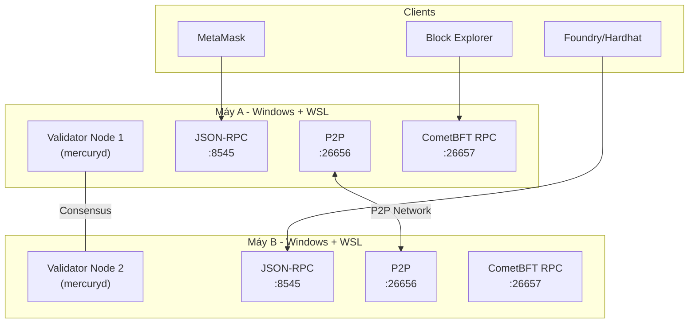
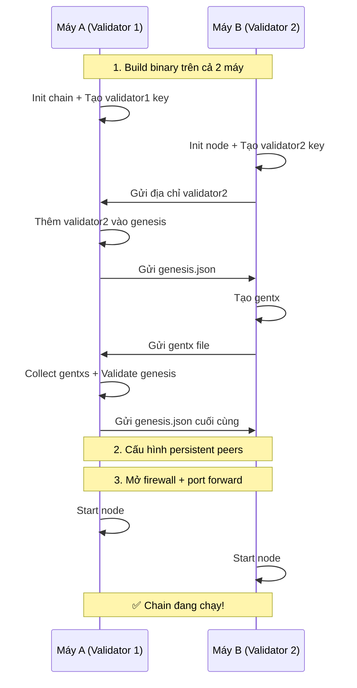

# 🚀 Mercury Blockchain - Hướng Dẫn Deploy & Test Multi-Node (2 máy Windows/WSL)

## Tổng Quan Kiến Trúc



---

## Bước 0: Yêu Cầu Hệ Thống

Trên **cả 2 máy Windows**, cần cài đặt:

| Phần mềm | Phiên bản | Mục đích |
|-----------|-----------|----------|
| WSL2 + Ubuntu | 22.04+ | Môi trường Linux |
| Go | 1.24+ | Build binary |
| jq | latest | Xử lý JSON genesis |
| Git | latest | Clone source code |

```bash
# Cài đặt trên WSL Ubuntu (chạy trên CẢ 2 máy)
sudo apt update && sudo apt upgrade -y
sudo apt install -y build-essential git jq curl

# Cài Go 1.24
wget https://go.dev/dl/go1.24.0.linux-amd64.tar.gz
sudo rm -rf /usr/local/go && sudo tar -C /usr/local -xzf go1.24.0.linux-amd64.tar.gz
echo 'export PATH=$PATH:/usr/local/go/bin:$HOME/go/bin' >> ~/.bashrc
source ~/.bashrc
go version
```

---

## Bước 1: Build Binary (trên cả 2 máy)

```bash
# Clone repo lên cả 2 máy
cd ~
git clone <your-mercury-repo-url> mercury
cd mercury

# Build và install binary
make install

# Xác nhận binary đã cài
mercuryd version
```

---

## Bước 2: Xác Định IP Của 2 Máy

Trước tiên cần biết IP LAN của mỗi máy:

```bash
# Chạy trên mỗi máy Windows (PowerShell)
ipconfig

# Hoặc trong WSL
ip addr show eth0
```

> [!IMPORTANT]
> Giả sử:
> - **Máy A** (Validator 1): `192.168.1.100`
> - **Máy B** (Validator 2): `192.168.1.200`
> 
> Thay bằng IP thực tế của bạn trong toàn bộ hướng dẫn.

---

## Bước 3: Thiết Lập Validator Node 1 (Máy A)

### 3.1 Khởi tạo Node

```bash
# Đặt biến
export CHAINID="mercury_9001-1"
export MONIKER="validator-1"
export KEYRING="file"          # dùng "file" cho production, không dùng "test"
export CHAINDIR="$HOME/.mercuryd"

# Xóa dữ liệu cũ (nếu có)
rm -rf $CHAINDIR

# Cấu hình client
mercuryd config set client chain-id "$CHAINID" --home "$CHAINDIR"
mercuryd config set client keyring-backend "$KEYRING" --home "$CHAINDIR"

# Tạo validator key (LƯU LẠI MNEMONIC!)
mercuryd keys add validator1 --keyring-backend "$KEYRING" --algo eth_secp256k1 --home "$CHAINDIR"
```

> [!CAUTION]
> **Lưu lại mnemonic phrase** khi tạo key! Đây là cách duy nhất để khôi phục tài khoản.

### 3.2 Khởi tạo Genesis

```bash
# Init chain
mercuryd init "$MONIKER" --chain-id "$CHAINID" --home "$CHAINDIR"

# Cấu hình genesis
GENESIS=$CHAINDIR/config/genesis.json
TMP_GENESIS=$CHAINDIR/config/tmp_genesis.json

# Token denomination
jq '.app_state["staking"]["params"]["bond_denom"]="amercury"' "$GENESIS" >"$TMP_GENESIS" && mv "$TMP_GENESIS" "$GENESIS"
jq '.app_state["gov"]["deposit_params"]["min_deposit"][0]["denom"]="amercury"' "$GENESIS" >"$TMP_GENESIS" && mv "$TMP_GENESIS" "$GENESIS"
jq '.app_state["gov"]["params"]["min_deposit"][0]["denom"]="amercury"' "$GENESIS" >"$TMP_GENESIS" && mv "$TMP_GENESIS" "$GENESIS"
jq '.app_state["gov"]["params"]["expedited_min_deposit"][0]["denom"]="amercury"' "$GENESIS" >"$TMP_GENESIS" && mv "$TMP_GENESIS" "$GENESIS"
jq '.app_state["evm"]["params"]["evm_denom"]="amercury"' "$GENESIS" >"$TMP_GENESIS" && mv "$TMP_GENESIS" "$GENESIS"
jq '.app_state["mint"]["params"]["mint_denom"]="amercury"' "$GENESIS" >"$TMP_GENESIS" && mv "$TMP_GENESIS" "$GENESIS"

# Token metadata
jq '.app_state["bank"]["denom_metadata"]=[{"description":"The native staking token for Mercury.","denom_units":[{"denom":"amercury","exponent":0,"aliases":["attomercury"]},{"denom":"mercury","exponent":18,"aliases":[]}],"base":"amercury","display":"mercury","name":"Mercury","symbol":"MERC","uri":"","uri_hash":""}]' "$GENESIS" >"$TMP_GENESIS" && mv "$TMP_GENESIS" "$GENESIS"

# EVM precompiles
jq '.app_state["evm"]["params"]["active_static_precompiles"]=["0x0000000000000000000000000000000000000100","0x0000000000000000000000000000000000000400","0x0000000000000000000000000000000000000800","0x0000000000000000000000000000000000000801","0x0000000000000000000000000000000000000802","0x0000000000000000000000000000000000000803","0x0000000000000000000000000000000000000804","0x0000000000000000000000000000000000000805","0x0000000000000000000000000000000000000806","0x0000000000000000000000000000000000000807"]' "$GENESIS" >"$TMP_GENESIS" && mv "$TMP_GENESIS" "$GENESIS"

# ERC20 native precompile
jq '.app_state.erc20.native_precompiles=["0xEeeeeEeeeEeEeeEeEeEeeEEEeeeeEeeeeeeeEEeE"]' "$GENESIS" >"$TMP_GENESIS" && mv "$TMP_GENESIS" "$GENESIS"
jq '.app_state.erc20.token_pairs=[{contract_owner:1,erc20_address:"0xEeeeeEeeeEeEeeEeEeEeeEEEeeeeEeeeeeeeEEeE",denom:"amercury",enabled:true}]' "$GENESIS" >"$TMP_GENESIS" && mv "$TMP_GENESIS" "$GENESIS"

# Block gas limit
jq '.consensus.params.block.max_gas="10000000"' "$GENESIS" >"$TMP_GENESIS" && mv "$TMP_GENESIS" "$GENESIS"

# Fund validator 1
mercuryd genesis add-genesis-account validator1 100000000000000000000000000amercury \
    --keyring-backend "$KEYRING" --home "$CHAINDIR"

# Tạo gentx cho validator 1
mercuryd genesis gentx validator1 1000000000000000000000amercury \
    --gas-prices 10000000amercury \
    --keyring-backend "$KEYRING" \
    --chain-id "$CHAINID" \
    --home "$CHAINDIR"
```

---

## Bước 4: Thiết Lập Validator Node 2 (Máy B)

### 4.1 Khởi tạo Node

```bash
export CHAINID="mercury_9001-1"
export MONIKER="validator-2"
export KEYRING="file"
export CHAINDIR="$HOME/.mercuryd"

rm -rf $CHAINDIR

mercuryd config set client chain-id "$CHAINID" --home "$CHAINDIR"
mercuryd config set client keyring-backend "$KEYRING" --home "$CHAINDIR"

# Tạo validator key (LƯU LẠI MNEMONIC!)
mercuryd keys add validator2 --keyring-backend "$KEYRING" --algo eth_secp256k1 --home "$CHAINDIR"

# Init node (dùng cùng chain-id)
mercuryd init "$MONIKER" --chain-id "$CHAINID" --home "$CHAINDIR"
```

---

## Bước 5: Chia Sẻ Genesis Giữa 2 Máy

> [!IMPORTANT]
> Đây là bước quan trọng nhất! Cả 2 node **phải** có cùng `genesis.json`.

### 5.1 Trên Máy B: Lấy địa chỉ validator2

```bash
# Lấy địa chỉ validator2
mercuryd keys show validator2 -a --keyring-backend "$KEYRING" --home "$CHAINDIR"
# Ví dụ output: cosmos1abc...xyz
```

### 5.2 Trên Máy A: Thêm validator2 vào genesis

```bash
# Thêm account cho validator2 (dùng địa chỉ từ Máy B)
mercuryd genesis add-genesis-account cosmos1abc...xyz 100000000000000000000000000amercury \
    --home "$CHAINDIR"
```

### 5.3 Copy genesis.json từ Máy A sang Máy B

```bash
# Trên Máy A: Copy file ra để transfer
cp $HOME/.mercuryd/config/genesis.json ~/genesis.json

# Transfer sang Máy B (dùng scp, USB, hoặc shared folder)
# Ví dụ dùng scp:
scp ~/genesis.json user@192.168.1.200:~/genesis.json

# Trên Máy B: Thay genesis
cp ~/genesis.json $HOME/.mercuryd/config/genesis.json
```

### 5.4 Trên Máy B: Tạo gentx và gửi lại Máy A

```bash
# Trên Máy B: Tạo gentx
mercuryd genesis gentx validator2 1000000000000000000000amercury \
    --gas-prices 10000000amercury \
    --keyring-backend "$KEYRING" \
    --chain-id "$CHAINID" \
    --home "$CHAINDIR"

# Copy gentx file sang Máy A
cp $HOME/.mercuryd/config/gentx/gentx-*.json ~/gentx-validator2.json
scp ~/gentx-validator2.json user@192.168.1.100:~/gentx-validator2.json
```

### 5.5 Trên Máy A: Collect tất cả gentxs

```bash
# Copy gentx của validator2 vào thư mục gentx
cp ~/gentx-validator2.json $HOME/.mercuryd/config/gentx/

# Collect tất cả gentxs
mercuryd genesis collect-gentxs --home "$CHAINDIR"

# Validate genesis
mercuryd genesis validate-genesis --home "$CHAINDIR"
```

### 5.6 Copy genesis.json cuối cùng sang Máy B

```bash
# Từ Máy A, copy genesis cuối cùng sang Máy B
scp $HOME/.mercuryd/config/genesis.json user@192.168.1.200:$HOME/.mercuryd/config/genesis.json
```

---

## Bước 6: Cấu Hình Mạng P2P

### 6.1 Lấy Node ID

```bash
# Trên Máy A
mercuryd comet show-node-id --home $HOME/.mercuryd
# Output ví dụ: a1b2c3d4e5f6...

# Trên Máy B  
mercuryd comet show-node-id --home $HOME/.mercuryd
# Output ví dụ: f6e5d4c3b2a1...
```

### 6.2 Cấu Hình Persistent Peers

```bash
# Trên Máy A ($HOME/.mercuryd/config/config.toml):
# Thêm Máy B làm persistent peer
sed -i 's/persistent_peers = ""/persistent_peers = "NODE_ID_MAY_B@192.168.1.200:26656"/' $HOME/.mercuryd/config/config.toml

# Trên Máy B ($HOME/.mercuryd/config/config.toml):
# Thêm Máy A làm persistent peer
sed -i 's/persistent_peers = ""/persistent_peers = "NODE_ID_MAY_A@192.168.1.100:26656"/' $HOME/.mercuryd/config/config.toml
```

### 6.3 Cấu Hình Lắng Nghe Trên Tất Cả Interface

```bash
# Trên CẢ 2 máy, sửa config.toml
sed -i 's/laddr = "tcp:\/\/127.0.0.1:26657"/laddr = "tcp:\/\/0.0.0.0:26657"/' $HOME/.mercuryd/config/config.toml
sed -i 's/laddr = "tcp:\/\/0.0.0.0:26656"/laddr = "tcp:\/\/0.0.0.0:26656"/' $HOME/.mercuryd/config/config.toml
```

### 6.4 Cấu Hình JSON-RPC (app.toml)

```bash
# Trên CẢ 2 máy, sửa app.toml để cho phép kết nối từ bên ngoài
sed -i 's/address = "127.0.0.1:8545"/address = "0.0.0.0:8545"/' $HOME/.mercuryd/config/app.toml
sed -i 's/ws-address = "127.0.0.1:8546"/ws-address = "0.0.0.0:8546"/' $HOME/.mercuryd/config/app.toml

# Bật JSON-RPC và API
sed -i 's/enable = false/enable = true/g' $HOME/.mercuryd/config/app.toml
sed -i 's/enabled = false/enabled = true/g' $HOME/.mercuryd/config/app.toml
sed -i 's/enable-indexer = false/enable-indexer = true/g' $HOME/.mercuryd/config/app.toml
```

---

## Bước 7: Mở Firewall (trên cả 2 máy Windows)

Chạy **PowerShell as Administrator** trên cả 2 máy:

```powershell
# Mở ports cho blockchain
New-NetFirewallRule -DisplayName "Mercury P2P" -Direction Inbound -Protocol TCP -LocalPort 26656 -Action Allow
New-NetFirewallRule -DisplayName "Mercury RPC" -Direction Inbound -Protocol TCP -LocalPort 26657 -Action Allow
New-NetFirewallRule -DisplayName "Mercury JSON-RPC" -Direction Inbound -Protocol TCP -LocalPort 8545 -Action Allow
New-NetFirewallRule -DisplayName "Mercury WS" -Direction Inbound -Protocol TCP -LocalPort 8546 -Action Allow
New-NetFirewallRule -DisplayName "Mercury gRPC" -Direction Inbound -Protocol TCP -LocalPort 9090 -Action Allow
New-NetFirewallRule -DisplayName "Mercury REST" -Direction Inbound -Protocol TCP -LocalPort 1317 -Action Allow
```

> [!WARNING]
> WSL2 dùng NAT networking. Bạn cần forward port từ Windows vào WSL:
> ```powershell
> # Chạy PowerShell as Admin trên mỗi máy
> # Lấy IP của WSL
> wsl hostname -I
> # Ví dụ output: 172.x.x.x
>
> # Forward các port cần thiết
> netsh interface portproxy add v4tov4 listenport=26656 listenaddress=0.0.0.0 connectport=26656 connectaddress=<WSL_IP>
> netsh interface portproxy add v4tov4 listenport=26657 listenaddress=0.0.0.0 connectport=26657 connectaddress=<WSL_IP>
> netsh interface portproxy add v4tov4 listenport=8545 listenaddress=0.0.0.0 connectport=8545 connectaddress=<WSL_IP>
> netsh interface portproxy add v4tov4 listenport=8546 listenaddress=0.0.0.0 connectport=8546 connectaddress=<WSL_IP>
> netsh interface portproxy add v4tov4 listenport=9090 listenaddress=0.0.0.0 connectport=9090 connectaddress=<WSL_IP>
> netsh interface portproxy add v4tov4 listenport=1317 listenaddress=0.0.0.0 connectport=1317 connectaddress=<WSL_IP>
> ```

---

## Bước 8: Khởi Chạy Cả 2 Node

### Trên Máy A:

```bash
mercuryd start \
    --pruning nothing \
    --log_level info \
    --minimum-gas-prices=0amercury \
    --evm.min-tip=0 \
    --home $HOME/.mercuryd \
    --json-rpc.api eth,txpool,personal,net,debug,web3 \
    --chain-id "mercury_9001-1"
```

### Trên Máy B:

```bash
mercuryd start \
    --pruning nothing \
    --log_level info \
    --minimum-gas-prices=0amercury \
    --evm.min-tip=0 \
    --home $HOME/.mercuryd \
    --json-rpc.api eth,txpool,personal,net,debug,web3 \
    --chain-id "mercury_9001-1"
```

### Kiểm tra kết nối:

```bash
# Kiểm tra node status
curl http://localhost:26657/status | jq '.result.sync_info'

# Kiểm tra peers
curl http://localhost:26657/net_info | jq '.result.n_peers'

# Kiểm tra qua JSON-RPC
curl -X POST http://localhost:8545 \
    -H "Content-Type: application/json" \
    -d '{"jsonrpc":"2.0","method":"eth_blockNumber","params":[],"id":1}'
```

---

## Bước 9: Kết Nối MetaMask

1. Mở MetaMask → **Settings** → **Networks** → **Add Network**
2. Điền thông tin:

| Field | Value |
|-------|-------|
| Network Name | Mercury Testnet |
| New RPC URL | `http://192.168.1.100:8545` |
| Chain ID | `9001` |
| Currency Symbol | `MERC` |
| Block Explorer URL | *(để trống hoặc dùng Blockscout nếu đã deploy)* |

3. Import private key của dev account để có token test

---

## Bước 10: Test Như Product Thực Tế

### 10.1 Test Transaction

```bash
# Dùng cast (Foundry) để gửi transaction
cast send --rpc-url http://192.168.1.100:8545 \
    --private-key <PRIVATE_KEY> \
    <TO_ADDRESS> --value 1ether
```

### 10.2 Deploy Smart Contract

```bash
# Dùng Foundry
cd ~/mercury/contracts
forge create --rpc-url http://192.168.1.100:8545 \
    --private-key <PRIVATE_KEY> \
    src/YourContract.sol:YourContract
```

### 10.3 Test Consensus

```bash
# Kiểm tra cả 2 node đang produce blocks
# Trên Máy A:
curl -s http://localhost:26657/status | jq '.result.sync_info.latest_block_height'

# Trên Máy B:
curl -s http://localhost:26657/status | jq '.result.sync_info.latest_block_height'

# Cả 2 phải cùng block height (hoặc chênh lệch 1-2 blocks)
```

### 10.4 Test Fault Tolerance

1. **Tắt 1 node** → chain phải dừng (vì chỉ có 2 validator, cần 2/3 đồng thuận)
2. **Bật lại** → chain phải tự resume

> [!NOTE]
> Với chỉ 2 validators, chain sẽ **dừng** khi 1 node offline (do yêu cầu 2/3 quorum).
> Để test fault tolerance thực tế, bạn cần **tối thiểu 4 validators** (có thể chạy nhiều node trên cùng 1 máy với ports khác nhau).

---

## Mẹo Chạy Node Như Service (Production)

Tạo systemd service để node tự khởi động:

```bash
sudo tee /etc/systemd/system/mercuryd.service > /dev/null <<EOF
[Unit]
Description=Mercury Blockchain Node
After=network-online.target
Wants=network-online.target

[Service]
User=$USER
ExecStart=$(which mercuryd) start \
    --pruning nothing \
    --log_level info \
    --minimum-gas-prices=0amercury \
    --evm.min-tip=0 \
    --home $HOME/.mercuryd \
    --json-rpc.api eth,txpool,personal,net,debug,web3 \
    --chain-id mercury_9001-1
Restart=always
RestartSec=3
LimitNOFILE=65535

[Install]
WantedBy=multi-user.target
EOF

sudo systemctl daemon-reload
sudo systemctl enable mercuryd
sudo systemctl start mercuryd

# Xem logs
journalctl -u mercuryd -f
```

---

## Tóm Tắt Quy Trình


