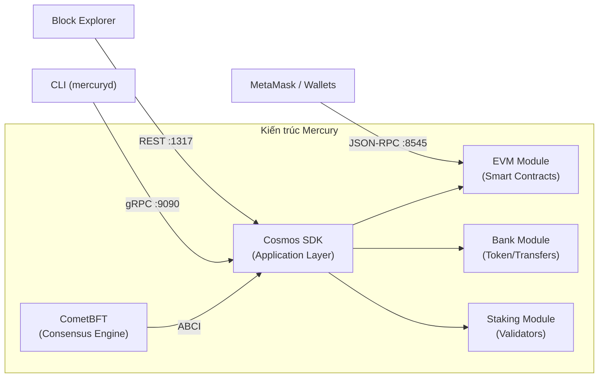

# 🚀 Mercury Blockchain — Hướng Dẫn Từ Zero Đến Multi-Node

> Hướng dẫn chi tiết cho người **chưa biết gì về DevOps**, đi từ chạy cơ bản trên 1 máy → deploy 2 máy qua mạng LAN.

---

## 📚 Blockchain Này Hoạt Động Như Thế Nào?



Mercury là một blockchain **EVM-compatible** xây trên **Cosmos SDK + CometBFT**:

| Thành phần | Vai trò |
|---|---|
| **CometBFT** | Đồng thuận BFT (Byzantine Fault Tolerant), quản lý P2P networking |
| **Cosmos SDK** | Application framework: bank, staking, governance... |
| **EVM Module** | Chạy smart contracts Solidity, tương thích Ethereum |
| **mercuryd** | Binary chính — vừa là node, vừa là CLI |

**Flow cơ bản:**
1. User gửi transaction (qua MetaMask hoặc CLI)
2. Transaction được broadcast lên mạng P2P  
3. Validators đồng thuận (propose → prevote → precommit)
4. Block được tạo, state được cập nhật
5. User nhận kết quả

---

## 🟢 PHẦN 1: Chạy Local Trên 1 Máy (Hiểu Cơ Bản)

### Bước 0: Cài đặt dependencies

Mở **WSL Ubuntu** trên 1 máy bất kỳ:

```bash
# Cập nhật hệ thống
sudo apt update && sudo apt upgrade -y

# Cài công cụ build
sudo apt install -y build-essential git jq curl wget

# Kiểm tra Go đã cài chưa
go version
# Nếu chưa có hoặc < 1.24:
wget https://go.dev/dl/go1.25.5.linux-amd64.tar.gz
sudo rm -rf /usr/local/go && sudo tar -C /usr/local -xzf go1.25.5.linux-amd64.tar.gz
echo 'export PATH=$PATH:/usr/local/go/bin:$HOME/go/bin' >> ~/.bashrc
source ~/.bashrc
go version
# Phải hiện: go version go1.25.5 linux/amd64
```

> [!NOTE]
> Project yêu cầu Go **1.25.5** (xem trong `go.mod`). Nếu link download không tồn tại, vào [go.dev/dl](https://go.dev/dl/) để tìm bản mới nhất >= 1.25.

### Bước 1: Build binary `mercuryd`

```bash
# Vào thư mục project
cd ~/mercury

# Build và cài binary
make install

# Kiểm tra
mercuryd version
# Nếu ra version number → thành công!

# Nếu lỗi "mercuryd: command not found":
export PATH=$PATH:$HOME/go/bin
echo 'export PATH=$PATH:$HOME/go/bin' >> ~/.bashrc
```

> [!TIP]
> `make install` sẽ compile code Go và cài binary `mercuryd` vào `$GOPATH/bin` (~`/home/<user>/go/bin`).

### Bước 2: Chạy local node đơn giản nhất

Project đã có sẵn script `local_node.sh` để khởi tạo và chạy một node đơn:

```bash
cd ~/mercury

# Chạy lần đầu — script sẽ:
# 1. Build binary (make install)
# 2. Khởi tạo chain (init)
# 3. Tạo genesis với các account test
# 4. Start node
./local_node.sh -y
```

**Giải thích flag:** `-y` = tự động ghi đè dữ liệu cũ (nếu có).

Nếu chạy thành công, bạn sẽ thấy log liên tục như:
```
INF committed state ... height=1
INF committed state ... height=2
INF committed state ... height=3
...
```

**🎉 Blockchain đang chạy! Mỗi dòng log = 1 block mới được tạo.**

### Bước 3: Tương tác với blockchain (mở terminal mới)

Mở **terminal WSL mới** (giữ nguyên terminal đang chạy node):

```bash
# 3.1 — Kiểm tra trạng thái node
curl -s http://localhost:26657/status | jq '.result.sync_info.latest_block_height'
# Output sẽ là số block hiện tại, ví dụ: "42"

# 3.2 — Kiểm tra balance các account test
mercuryd q bank balances $(mercuryd keys show dev0 -a --keyring-backend test --home $HOME/.mercuryd) \
    --home $HOME/.mercuryd
# Sẽ hiện số dư amercury của account dev0

# 3.3 — Gửi token giữa 2 account
mercuryd tx bank send dev0 $(mercuryd keys show dev1 -a --keyring-backend test --home $HOME/.mercuryd) \
    1000000000000000000amercury \
    --keyring-backend test \
    --home $HOME/.mercuryd \
    --chain-id 9001 \
    --gas auto \
    --gas-adjustment 1.5 \
    --gas-prices 10000000amercury \
    -y
# → Transaction sent! Kiểm tra balance lại để thấy thay đổi

# 3.4 — Thử JSON-RPC (Ethereum-compatible API)
curl -X POST http://localhost:8545 \
    -H "Content-Type: application/json" \
    -d '{"jsonrpc":"2.0","method":"eth_blockNumber","params":[],"id":1}'
# Output: {"jsonrpc":"2.0","id":1,"result":"0x2a"} (block number dạng hex)

curl -X POST http://localhost:8545 \
    -H "Content-Type: application/json" \
    -d '{"jsonrpc":"2.0","method":"eth_chainId","params":[],"id":1}'
# Output: {"jsonrpc":"2.0","id":1,"result":"0x2329"} (9001 = 0x2329)
```

### Bước 4: Kết nối MetaMask (trên Windows)

1. Mở **MetaMask** trên browser Windows
2. **Settings → Networks → Add Network → Add a network manually**
3. Điền:

| Field | Value |
|---|---|
| Network Name | `Mercury Local` |
| New RPC URL | `http://localhost:8545` |
| Chain ID | `9001` |
| Currency Symbol | `MERC` |

4. **Import dev account** để dùng token test:
   - MetaMask → Import Account → Paste private key
   - Private key dev0: `0x88cbead91aee890d27bf06e003ade3d4e952427e88f88d31d61d3ef5e5d54305`

> [!IMPORTANT]
> Sau khi import, MetaMask sẽ hiện balance ~1000 MERC. Bạn có thể gửi token qua MetaMask như dùng Ethereum thật!

### Bước 5: Dừng node

Quay lại terminal đang chạy node và nhấn `Ctrl+C` để dừng.

> [!TIP]
> **Chạy lại:** `./local_node.sh -n` (flag `-n` = giữ dữ liệu cũ, không khởi tạo lại)\
> **Khởi tạo lại từ đầu:** `./local_node.sh -y` (xóa sạch dữ liệu)

---

## 🔵 PHẦN 2: Deploy 2 Máy Qua Mạng LAN (Multi-Node)

Phần này sẽ hướng dẫn bạn chạy **2 validator nodes** trên **2 laptop**, kết nối qua mạng LAN.

```mermaid
sequenceDiagram
    participant A as 🖥️ Laptop A (Validator 1)
    participant B as 🖥️ Laptop B (Validator 2)
    
    Note over A,B: === CHUẨN BỊ ===
    A->>A: Build mercuryd + Init chain
    B->>B: Build mercuryd + Init node
    
    Note over A,B: === CHIA SẺ GENESIS ===
    B->>A: Gửi địa chỉ validator2
    A->>A: Thêm validator2 vào genesis
    A->>B: Gửi genesis.json (lần 1)
    B->>B: Tạo gentx
    B->>A: Gửi file gentx
    A->>A: Collect gentxs
    A->>B: Gửi genesis.json (cuối cùng)
    
    Note over A,B: === CẤU HÌNH ===
    A->>A: Thêm peer B
    B->>B: Thêm peer A
    Note over A,B: Mở firewall + port forward
    
    Note over A,B: === CHẠY ===
    A->>A: mercuryd start
    B->>B: mercuryd start
    A<-->B: ✅ Consensus đang hoạt động!
```

### Bước 6: Chuẩn bị cả 2 máy

**Trên CẢ 2 laptop**, lặp lại Bước 0 + Bước 1:

```bash
# Trên mỗi máy:
sudo apt update && sudo apt upgrade -y
sudo apt install -y build-essential git jq curl wget

# Cài Go (nếu chưa có)
# ... (xem Bước 0 ở trên)

# Clone code
cd ~
git clone <your-mercury-repo-url> mercury
cd mercury
make install
mercuryd version
```

### Bước 7: Xác định IP của 2 máy

Mở **PowerShell** trên mỗi máy Windows:

```powershell
# Tìm IP LAN (IPv4 Address trong phần Wi-Fi hoặc Ethernet)
ipconfig
```

Ghi lại IP — ví dụ:
- **Laptop A**: `192.168.1.100`
- **Laptop B**: `192.168.1.200`

> [!IMPORTANT]
> **Ping thử** để đảm bảo 2 máy thấy nhau:
> ```powershell
> # Trên Laptop A:
> ping 192.168.1.200
> # Trên Laptop B:
> ping 192.168.1.100
> ```
> Nếu ping không được, kiểm tra: cùng mạng Wi-Fi? Firewall có chặn không?

### Bước 8: Thiết lập Validator 1 (Laptop A)

```bash
# === Trên Laptop A ===

# Đặt biến
export CHAINID="mercury_9001-1"
export MONIKER="validator-1"
export KEYRING="test"       # dùng "test" cho đơn giản, "file" cho bảo mật hơn
export CHAINDIR="$HOME/.mercuryd"

# Xóa dữ liệu cũ
rm -rf $CHAINDIR

# Cấu hình
mercuryd config set client chain-id "$CHAINID" --home "$CHAINDIR"
mercuryd config set client keyring-backend "$KEYRING" --home "$CHAINDIR"

# Tạo key cho validator 1
mercuryd keys add validator1 --keyring-backend "$KEYRING" --algo eth_secp256k1 --home "$CHAINDIR"
```

**⚠️ LƯU LẠI mnemonic phrase hiện ra trên màn hình!**

```bash
# Khởi tạo chain
mercuryd init "$MONIKER" --chain-id "$CHAINID" --home "$CHAINDIR"

# === Cấu hình genesis ===
GENESIS=$CHAINDIR/config/genesis.json
TMP_GENESIS=$CHAINDIR/config/tmp_genesis.json

# Đổi token denomination sang amercury
jq '.app_state["staking"]["params"]["bond_denom"]="amercury"' "$GENESIS" >"$TMP_GENESIS" && mv "$TMP_GENESIS" "$GENESIS"
jq '.app_state["gov"]["deposit_params"]["min_deposit"][0]["denom"]="amercury"' "$GENESIS" >"$TMP_GENESIS" && mv "$TMP_GENESIS" "$GENESIS"
jq '.app_state["gov"]["params"]["min_deposit"][0]["denom"]="amercury"' "$GENESIS" >"$TMP_GENESIS" && mv "$TMP_GENESIS" "$GENESIS"
jq '.app_state["gov"]["params"]["expedited_min_deposit"][0]["denom"]="amercury"' "$GENESIS" >"$TMP_GENESIS" && mv "$TMP_GENESIS" "$GENESIS"
jq '.app_state["evm"]["params"]["evm_denom"]="amercury"' "$GENESIS" >"$TMP_GENESIS" && mv "$TMP_GENESIS" "$GENESIS"
jq '.app_state["mint"]["params"]["mint_denom"]="amercury"' "$GENESIS" >"$TMP_GENESIS" && mv "$TMP_GENESIS" "$GENESIS"

# Token metadata
jq '.app_state["bank"]["denom_metadata"]=[{"description":"The native staking token for Mercury.","denom_units":[{"denom":"amercury","exponent":0,"aliases":["attomercury"]},{"denom":"mercury","exponent":18,"aliases":[]}],"base":"amercury","display":"mercury","name":"Mercury","symbol":"MERC","uri":"","uri_hash":""}]' "$GENESIS" >"$TMP_GENESIS" && mv "$TMP_GENESIS" "$GENESIS"

# EVM precompiles
jq '.app_state["evm"]["params"]["active_static_precompiles"]=["0x0000000000000000000000000000000000000100","0x0000000000000000000000000000000000000400","0x0000000000000000000000000000000000000800","0x0000000000000000000000000000000000000801","0x0000000000000000000000000000000000000802","0x0000000000000000000000000000000000000803","0x0000000000000000000000000000000000000804","0x0000000000000000000000000000000000000805","0x0000000000000000000000000000000000000806","0x0000000000000000000000000000000000000807"]' "$GENESIS" >"$TMP_GENESIS" && mv "$TMP_GENESIS" "$GENESIS"

# ERC20
jq '.app_state.erc20.native_precompiles=["0xEeeeeEeeeEeEeeEeEeEeeEEEeeeeEeeeeeeeEEeE"]' "$GENESIS" >"$TMP_GENESIS" && mv "$TMP_GENESIS" "$GENESIS"
jq '.app_state.erc20.token_pairs=[{contract_owner:1,erc20_address:"0xEeeeeEeeeEeEeeEeEeEeeEEEeeeeEeeeeeeeEEeE",denom:"amercury",enabled:true}]' "$GENESIS" >"$TMP_GENESIS" && mv "$TMP_GENESIS" "$GENESIS"

# Block gas limit
jq '.consensus.params.block.max_gas="10000000"' "$GENESIS" >"$TMP_GENESIS" && mv "$TMP_GENESIS" "$GENESIS"

# Fund validator 1 (100 triệu MERC)
mercuryd genesis add-genesis-account validator1 100000000000000000000000000amercury \
    --keyring-backend "$KEYRING" --home "$CHAINDIR"
```

### Bước 9: Thiết lập Validator 2 (Laptop B)

```bash
# === Trên Laptop B ===

export CHAINID="mercury_9001-1"
export MONIKER="validator-2"
export KEYRING="test"
export CHAINDIR="$HOME/.mercuryd"

rm -rf $CHAINDIR

mercuryd config set client chain-id "$CHAINID" --home "$CHAINDIR"
mercuryd config set client keyring-backend "$KEYRING" --home "$CHAINDIR"

# Tạo key cho validator 2
mercuryd keys add validator2 --keyring-backend "$KEYRING" --algo eth_secp256k1 --home "$CHAINDIR"
# ⚠️ LƯU LẠI mnemonic!

# Init node
mercuryd init "$MONIKER" --chain-id "$CHAINID" --home "$CHAINDIR"
```

### Bước 10: Chia sẻ Genesis (qua lại giữa 2 máy)

Đây là bước quan trọng nhất — cả hai node **phải** có cùng một `genesis.json`.

#### 10.1 — Laptop B: Lấy địa chỉ validator2

```bash
# Trên Laptop B:
mercuryd keys show validator2 -a --keyring-backend test --home $HOME/.mercuryd
# Output ví dụ: cosmos1abc...xyz  ← COPY địa chỉ này
```

#### 10.2 — Laptop A: Thêm validator2 vào genesis

```bash
# Trên Laptop A — thay <VALIDATOR2_ADDRESS> bằng địa chỉ ở trên
mercuryd genesis add-genesis-account <VALIDATOR2_ADDRESS> 100000000000000000000000000amercury \
    --home "$CHAINDIR"

# Tạo gentx cho validator 1
mercuryd genesis gentx validator1 1000000000000000000000amercury \
    --gas-prices 10000000amercury \
    --keyring-backend "$KEYRING" \
    --chain-id "$CHAINID" \
    --home "$CHAINDIR"
```

#### 10.3 — Copy genesis từ Laptop A → Laptop B

Chọn **một trong các cách** sau:

**Cách 1: USB drive**
```bash
# Laptop A:
cp $HOME/.mercuryd/config/genesis.json /mnt/d/genesis.json  # USB mount tại D:

# Laptop B:
cp /mnt/d/genesis.json $HOME/.mercuryd/config/genesis.json
```

**Cách 2: Shared folder (nếu cùng mạng)**
```bash
# Laptop A: share bằng Python HTTP server
cd $HOME/.mercuryd/config
python3 -m http.server 9999

# Laptop B: download
wget http://192.168.1.100:9999/genesis.json -O $HOME/.mercuryd/config/genesis.json
```

**Cách 3: Copy-paste nội dung**
```bash
# Laptop A:
cat $HOME/.mercuryd/config/genesis.json
# Copy toàn bộ nội dung

# Laptop B:
nano $HOME/.mercuryd/config/genesis.json
# Paste nội dung, save (Ctrl+O, Enter, Ctrl+X)
```

#### 10.4 — Laptop B: Tạo gentx

```bash
# Trên Laptop B:
mercuryd genesis gentx validator2 1000000000000000000000amercury \
    --gas-prices 10000000amercury \
    --keyring-backend "$KEYRING" \
    --chain-id "$CHAINID" \
    --home "$CHAINDIR"

# Copy gentx file sang Laptop A (dùng cách tương tự ở trên)
# File nằm tại: $HOME/.mercuryd/config/gentx/gentx-*.json
ls $HOME/.mercuryd/config/gentx/
# Copy file gentx-*.json này sang Laptop A
```

#### 10.5 — Laptop A: Hoàn tất genesis

```bash
# Trên Laptop A:
# Copy file gentx từ Laptop B vào thư mục gentx
# (thay tên file cho đúng)
cp ~/gentx-validator2.json $HOME/.mercuryd/config/gentx/

# Collect tất cả gentxs
mercuryd genesis collect-gentxs --home "$CHAINDIR"

# Validate genesis
mercuryd genesis validate-genesis --home "$CHAINDIR"
# Phải hiện: "genesis.json is valid" hoặc không có lỗi
```

#### 10.6 — Copy genesis **cuối cùng** từ A → B

```bash
# QUAN TRỌNG: Copy TOÀN BỘ genesis.json cuối cùng sang Laptop B
# Dùng cách nào ở 10.3 cũng được

# Laptop A:
cd $HOME/.mercuryd/config && python3 -m http.server 9999

# Laptop B:
wget http://192.168.1.100:9999/genesis.json -O $HOME/.mercuryd/config/genesis.json
```

### Bước 11: Cấu hình P2P Networking

#### 11.1 — Lấy Node ID

```bash
# Trên Laptop A:
mercuryd comet show-node-id --home $HOME/.mercuryd
# Output ví dụ: a1b2c3d4e5f6g7h8i9j0...  ← COPY

# Trên Laptop B:
mercuryd comet show-node-id --home $HOME/.mercuryd
# Output ví dụ: z9y8x7w6v5u4t3s2r1q0...  ← COPY
```

#### 11.2 — Cấu hình Peers

```bash
# === Trên Laptop A: thêm Laptop B làm peer ===
# Thay NODE_ID_B = node ID của Laptop B
# Thay 192.168.1.200 = IP thực của Laptop B
sed -i 's/persistent_peers = ""/persistent_peers = "NODE_ID_B@192.168.1.200:26656"/' \
    $HOME/.mercuryd/config/config.toml

# === Trên Laptop B: thêm Laptop A làm peer ===
sed -i 's/persistent_peers = ""/persistent_peers = "NODE_ID_A@192.168.1.100:26656"/' \
    $HOME/.mercuryd/config/config.toml
```

#### 11.3 — Mở RPC cho kết nối bên ngoài

```bash
# Trên CẢ 2 Laptop:

# Mở CometBFT RPC
sed -i 's/laddr = "tcp:\/\/127.0.0.1:26657"/laddr = "tcp:\/\/0.0.0.0:26657"/' \
    $HOME/.mercuryd/config/config.toml

# Mở JSON-RPC cho MetaMask
sed -i 's/address = "127.0.0.1:8545"/address = "0.0.0.0:8545"/' \
    $HOME/.mercuryd/config/app.toml
sed -i 's/ws-address = "127.0.0.1:8546"/ws-address = "0.0.0.0:8546"/' \
    $HOME/.mercuryd/config/app.toml

# Bật các API
sed -i 's/enable = false/enable = true/g' $HOME/.mercuryd/config/app.toml
sed -i 's/enabled = false/enabled = true/g' $HOME/.mercuryd/config/app.toml
sed -i 's/enable-indexer = false/enable-indexer = true/g' $HOME/.mercuryd/config/app.toml
```

### Bước 12: Mở Firewall + Port Forward (Windows)

> [!WARNING]
> WSL2 dùng **NAT networking** — máy bên ngoài không thể trực tiếp kết nối vào WSL. Bạn cần **forward port** từ Windows vào WSL.

Chạy **PowerShell as Administrator** trên **CẢ 2 laptop**:

```powershell
# Bước 1: Lấy IP của WSL
wsl hostname -I
# Output ví dụ: 172.25.160.1  ← lưu lại

# Bước 2: Forward ports (thay <WSL_IP> = IP ở trên)
netsh interface portproxy add v4tov4 listenport=26656 listenaddress=0.0.0.0 connectport=26656 connectaddress=<WSL_IP>
netsh interface portproxy add v4tov4 listenport=26657 listenaddress=0.0.0.0 connectport=26657 connectaddress=<WSL_IP>
netsh interface portproxy add v4tov4 listenport=8545 listenaddress=0.0.0.0 connectport=8545 connectaddress=<WSL_IP>
netsh interface portproxy add v4tov4 listenport=8546 listenaddress=0.0.0.0 connectport=8546 connectaddress=<WSL_IP>
netsh interface portproxy add v4tov4 listenport=9090 listenaddress=0.0.0.0 connectport=9090 connectaddress=<WSL_IP>
netsh interface portproxy add v4tov4 listenport=1317 listenaddress=0.0.0.0 connectport=1317 connectaddress=<WSL_IP>

# Bước 3: Mở firewall
New-NetFirewallRule -DisplayName "Mercury P2P" -Direction Inbound -Protocol TCP -LocalPort 26656 -Action Allow
New-NetFirewallRule -DisplayName "Mercury RPC" -Direction Inbound -Protocol TCP -LocalPort 26657 -Action Allow
New-NetFirewallRule -DisplayName "Mercury JSON-RPC" -Direction Inbound -Protocol TCP -LocalPort 8545 -Action Allow
New-NetFirewallRule -DisplayName "Mercury WS" -Direction Inbound -Protocol TCP -LocalPort 8546 -Action Allow
New-NetFirewallRule -DisplayName "Mercury gRPC" -Direction Inbound -Protocol TCP -LocalPort 9090 -Action Allow
New-NetFirewallRule -DisplayName "Mercury REST" -Direction Inbound -Protocol TCP -LocalPort 1317 -Action Allow

# Kiểm tra port proxy đã thiết lập:
netsh interface portproxy show all
```

> [!CAUTION]
> **Mỗi khi khởi động lại WSL**, IP có thể thay đổi. Bạn cần chạy lại lệnh `netsh interface portproxy` với IP mới. Để tiện, tạo script sau:

```powershell
# Lưu thành file: fix-wsl-ports.ps1
$wslIp = (wsl hostname -I).Trim()
Write-Host "WSL IP: $wslIp"

$ports = @(26656, 26657, 8545, 8546, 9090, 1317)
foreach ($port in $ports) {
    netsh interface portproxy delete v4tov4 listenport=$port listenaddress=0.0.0.0 2>$null
    netsh interface portproxy add v4tov4 listenport=$port listenaddress=0.0.0.0 connectport=$port connectaddress=$wslIp
    Write-Host "Forwarded port $port -> $wslIp:$port"
}
```

### Bước 13: Khởi chạy cả 2 node!

```bash
# === Trên Laptop A (WSL terminal): ===
mercuryd start \
    --pruning nothing \
    --log_level info \
    --minimum-gas-prices=0amercury \
    --evm.min-tip=0 \
    --home $HOME/.mercuryd \
    --json-rpc.api eth,txpool,personal,net,debug,web3 \
    --chain-id "mercury_9001-1"

# === Trên Laptop B (WSL terminal): ===
mercuryd start \
    --pruning nothing \
    --log_level info \
    --minimum-gas-prices=0amercury \
    --evm.min-tip=0 \
    --home $HOME/.mercuryd \
    --json-rpc.api eth,txpool,personal,net,debug,web3 \
    --chain-id "mercury_9001-1"
```

### Bước 14: Kiểm tra mọi thứ hoạt động

Mở terminal mới trên **mỗi laptop**:

```bash
# 14.1 — Block height (phải tăng liên tục)
curl -s http://localhost:26657/status | jq '.result.sync_info.latest_block_height'

# 14.2 — Số peers (phải = 1 cho mỗi node)
curl -s http://localhost:26657/net_info | jq '.result.n_peers'

# 14.3 — JSON-RPC
curl -X POST http://localhost:8545 \
    -H "Content-Type: application/json" \
    -d '{"jsonrpc":"2.0","method":"eth_blockNumber","params":[],"id":1}'

# 14.4 — Kiểm tra cross-machine (từ Laptop A sang B)
curl -s http://192.168.1.200:26657/status | jq '.result.sync_info.latest_block_height'
```

---

## 🧪 PHẦN 3: Test Nâng Cao

### Test 1: Gửi Transaction giữa 2 máy

```bash
# Trên Laptop A: Gửi token tới một địa chỉ trên Laptop B
mercuryd tx bank send validator1 <VALIDATOR2_ADDRESS> \
    1000000000000000000amercury \
    --keyring-backend test \
    --home $HOME/.mercuryd \
    --chain-id mercury_9001-1 \
    --gas auto --gas-adjustment 1.5 \
    --gas-prices 10000000amercury -y

# Trên Laptop B: Kiểm tra balance
mercuryd q bank balances <VALIDATOR2_ADDRESS> --home $HOME/.mercuryd
```

### Test 2: MetaMask kết nối multi-node

| Field | Laptop A | Laptop B |
|---|---|---|
| RPC URL | `http://192.168.1.100:8545` | `http://192.168.1.200:8545` |
| Chain ID | `9001` | `9001` |
| Symbol | `MERC` | `MERC` |

Bạn có thể mở MetaMask trên máy nào cũng được, kết nối tới bất kỳ node nào.

### Test 3: Tắt 1 node để test fault tolerance

```bash
# Tắt Laptop B (Ctrl+C trên terminal đang chạy node)
# → Blockchain sẽ DỪNG vì chỉ còn 1/2 validators (cần 2/3 = 67%)

# Bật lại Laptop B
mercuryd start ... (lệnh giống Bước 13)
# → Blockchain tự động resume sản xuất block!
```

> [!NOTE]
> Với chỉ 2 validators, chain LUÔN dừng khi 1 node offline. Đây là đúng thiết kế của CometBFT (cần >2/3 voting power online). Muốn chịu được 1 node fail → cần **tối thiểu 4 validators**.

---

## 🔧 Troubleshooting

| Vấn đề | Nguyên nhân | Giải pháp |
|---|---|---|
| `mercuryd: command not found` | Binary chưa trong PATH | `export PATH=$PATH:$HOME/go/bin` |
| Node không kết nối peer | Firewall chặn / IP sai / Port forward chưa set | Kiểm tra lại Bước 12 |
| `wrong Block.Header.AppHash` | Genesis khác nhau giữa 2 node | Kiểm tra cả 2 có cùng genesis.json |
| Chain không produce block | Không đủ 2/3 validators online | Đảm bảo CẢ 2 node đang chạy |
| MetaMask không kết nối | WSL port forward chưa thiết lập | Chạy lại script PowerShell ở Bước 12 |
| `bind: address already in use` | Port đã bị chiếm | `lsof -i :8545` rồi kill process |

---

## 📊 Port Reference

| Port | Protocol | Mục đích |
|------|----------|----------|
| **26656** | TCP | P2P (node-to-node) |
| **26657** | TCP | CometBFT RPC |
| **8545** | TCP/HTTP | EVM JSON-RPC (MetaMask) |
| **8546** | TCP/WS | EVM WebSocket |
| **9090** | TCP | gRPC |
| **1317** | TCP | REST API |
